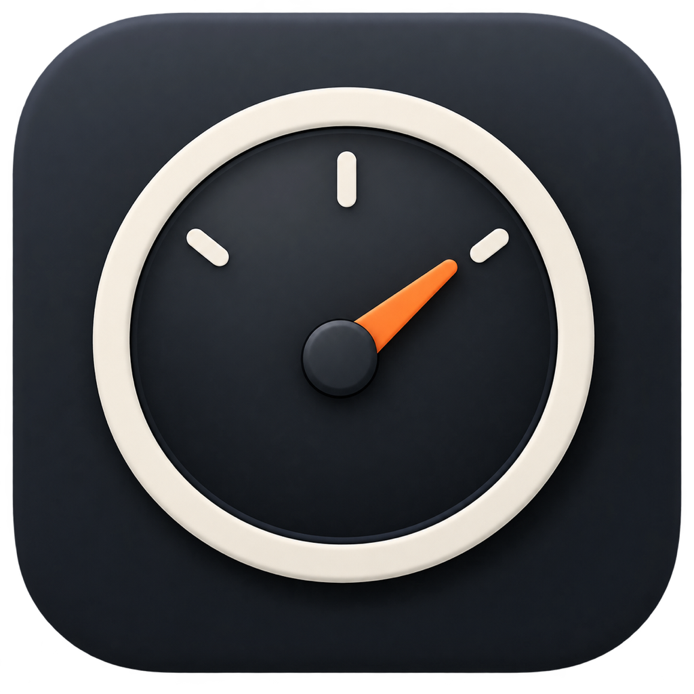

<p align="center">
  
</p>

<h1 align="center">CodexGauge</h1>

<p align="center">
  A native, read-only menu-bar monitor for Codex allowances and activity.<br>
  Uses the Codex app server and local metadata already available on your Mac—no additional login, API key, or account token required.
</p>

<p align="center"><sub>Independent software from North Wolf Labs. Not affiliated with or endorsed by OpenAI or Apple.</sub></p>

## Compatibility

- Apple Silicon and Intel (`arm64` + `x86_64` Universal 2)
- macOS 14.4 or later
- An installed and signed-in ChatGPT or Codex app, or a compatible Codex executable
- Public releases are validated on Apple silicon, an Intel Mac, macOS 14.4, and the current macOS release line

Intel support begins with CodexGauge 1.2.0. CodexGauge 1.1.1 and earlier remain Apple-silicon-only releases.

## What it shows

- Every allowance bucket and window returned by Codex, including reset time, remaining percentage, pacing estimates when enough metadata exists, credits, spend controls, and earned resets
- A customizable menu-bar summary with a primary and optional additional allowance, reset timing, an estimated sustainable pace, and optional semantic status colors
- Live tasks on this Mac, including phase, current-turn duration, rolling token rate, token mix, latest context use, response-start latency, and linked-agent count
- Up to 200 recent local root tasks from the previous 24 hours
- Account-wide daily activity, period comparisons, lifetime tokens, streaks, peak day, and longest turn
- Optional allowance and privacy-safe task-attention notifications

Task token rates measure local activity. They are not a task’s share of the account allowance. Tasks that run only on another computer are not visible locally.

Menu-bar customization is available in **Settings > Menu Bar**. The default remains a monochrome gauge and the Codex allowance with the least remaining. Reset timing, an additional allowance, suggested pace, and colors are opt-in. Suggested pace can show either the percentage points available per day or hour, or the remaining target at the end of the current allowance day or hour. Both are local estimates, not separate daily allowances issued by OpenAI.

Warnings Only keeps normal values monochrome and adds yellow or red only when an allowance or its projected usage needs attention. Traffic Light also uses green for a healthy status. Remaining-allowance warnings begin at 20% and become critical at 10%. Usage pace turns yellow when the current pace is projected to use 90–100% by reset, and red when it is projected to run out early. Pacing status is withheld immediately after a reset, when whole-percentage account data is too coarse for a reliable projection. Every warning is explained at the top of the popover and reinforced through its symbol and accessibility text. If a specifically selected allowance temporarily disappears, CodexGauge keeps the preference and shows the lowest Codex allowance until it returns; an additional fallback is hidden when it would duplicate the main percentage.

## Installation

1. Download the `universal.dmg` from the repository’s Releases page. The same app runs natively on Apple silicon and Intel Macs.
2. Verify the checksum in `SHA256SUMS`:

   ```sh
   shasum -a 256 -c SHA256SUMS
   ```

3. Open the DMG and drag CodexGauge to Applications.
4. Launch CodexGauge. It appears only in the menu bar.

To inspect Apple’s signature and notarization result:

```sh
codesign --verify --deep --strict --verbose=2 /Applications/CodexGauge.app
spctl --assess --type execute --verbose=4 /Applications/CodexGauge.app
```

CodexGauge immediately searches for a usable Codex helper. Use **Settings > General** only if automatic discovery cannot find it or your Codex data folder is nonstandard.

## Architecture

One AppKit-owned application lifecycle manages the status item, popover, Settings, Help, and Dashboard windows. SwiftUI provides the interface, Charts, gauges, forms, and accessibility behavior.

`CodexAppServerClient` keeps a newline-delimited JSON-RPC subprocess connection to the installed helper. Account identity and aggregate activity update at connection and every 15 minutes; allowance polling uses the selected 1, 5, 15, 30, 60, or 120-second cadence. Allowance-change notifications coalesce into an allowance-only refresh.

`LocalSessionMonitor` uses FSEvents plus a one-second bounded safety check for known live tasks. It incrementally tails bounded JSONL records, watches writer locks, rotates lightweight checks across inactive files, folds linked agents into root tasks, and retains all live tasks plus up to 200 recent root tasks from the prior 24 hours. The popover shows four recent tasks; the Dashboard starts with ten and reveals ten more per action.

Provider protocols and an injectable clock keep account, local-session, notification, date-range, freshness, and pacing behavior testable.

Menu-bar countdowns are updated by a local one-shot timer only when their displayed hour or minute changes. They do not trigger account requests or add a one-second polling loop.

## Privacy

CodexGauge has no analytics, backend, updater, or telemetry upload. It does not model or retain prompts, answers, reasoning, command output, tool contents, email, credentials, or authentication tokens.

Only preferences, notification deduplication keys, and the latest account snapshot are persisted. Task identifiers and telemetry remain in memory. Notification Center receives generic attention text without task names. See [PRIVACY.md](PRIVACY.md) for the complete boundary.

## Build and test

The required stable toolchain is recorded in [.xcode-version](.xcode-version). The project intentionally fails release validation under a different Xcode build.

```sh
DEVELOPER_DIR=/Applications/Xcode.app/Contents/Developer ./Scripts/check-toolchain.sh

DEVELOPER_DIR=/Applications/Xcode.app/Contents/Developer \
xcodebuild build -project CodexGauge.xcodeproj -scheme CodexGauge \
  -configuration Release -destination 'generic/platform=macOS' \
  ARCHS='arm64 x86_64' ONLY_ACTIVE_ARCH=NO CODE_SIGNING_ALLOWED=NO

for architecture in arm64 x86_64; do
  DEVELOPER_DIR=/Applications/Xcode.app/Contents/Developer \
  xcodebuild test -project CodexGauge.xcodeproj -scheme CodexGauge \
    -destination "platform=macOS,arch=$architecture" ARCHS="$architecture" \
    CODE_SIGN_STYLE=Manual CODE_SIGN_IDENTITY=- DEVELOPMENT_TEAM=
done
```

An Apple-silicon development Mac can execute both test commands; Xcode runs the `x86_64` test process through Rosetta. An Intel development Mac runs the `x86_64` tests and can still compile the Universal 2 archive. UI tests require macOS Accessibility/Automation permission for Xcode’s test runner. CI performs them on clean Apple-silicon and Intel runners. The macOS 14 compatibility job records and uses the newest Xcode supported by that runner; release artifacts are built only with the exact toolchain in `.xcode-version`.

Every local release also runs a deterministic 25-minute Release-mode resource gate. Quit other CodexGauge instances before running it:

```sh
./Scripts/performance-check.sh
```

The committed budgets require a closed app to average under 1% CPU and remain below 100 MB physical footprint, with separate limits for visible and expanded surfaces. See [Performance/README.md](Performance/README.md) for scenarios, measurements, and diagnostic artifacts.

The application target uses macOS 14.4, hardened runtime, no App Sandbox, `LSUIElement`, and the Standard Architectures setting. Release archives contain exactly the native `arm64` and `x86_64` slices. The checked-in Icon Composer source is compiled with the asset catalog so current macOS releases use the native layered icon and older supported releases receive Xcode's compatibility representation.

## Troubleshooting

### Usage is unavailable

Open ChatGPT and confirm that you are signed in. CodexGauge keeps trying automatically. If it cannot find Codex, choose the helper in Settings; a manually selected helper is launched and initialized before CodexGauge accepts it.

### A task is missing

Confirm that the task ran on this Mac during the past 24 hours. Remote-only tasks cannot be discovered from local files. Unlinked internal work may appear as background Codex work.

### Data is stale

CodexGauge retains the last successful account snapshot while offline or signed out and clearly marks it stale. The refresh loop uses bounded backoff rather than retrying continuously.

### Notifications do not appear

Check **Settings > Notifications**. If permission is denied, use **Open Notification Settings**. Each allowance threshold is sent once per reset cycle. A task attention alert is sent only for an exact local input or approval request.

## Authentic releases

Official downloads are published through this repository's GitHub Releases page. Starting with version 1.2.0, the `-universal.dmg` contains both Apple-silicon and Intel slices; a separate architecture-specific download is unnecessary. Each release also contains a `SHA256SUMS` file for that download. Debug symbols, build records, and notarization receipts are retained separately as release-engineering records. Private signing and publication procedures are intentionally not documented in this public repository.

## Contributing and support

See [CONTRIBUTING.md](CONTRIBUTING.md), [SUPPORT.md](SUPPORT.md), [SECURITY.md](SECURITY.md), and [CODE_OF_CONDUCT.md](CODE_OF_CONDUCT.md).

CodexGauge is licensed under [Apache License 2.0](LICENSE).
